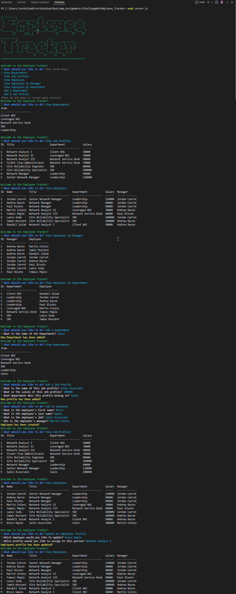

# Employee_Tracker
  

  ## Description:
My assignment this week is to build a command-line application from scratch to manage a company's employee database, using Node.js, Inquirer, and MySQL. I ended up trying out some additional packages in this assignment as well like colors and sql-template-strings. The latter is very handy when working with MySQL and wanting to utilize literals.

The application works to store employees, their job profiles, departments, and managers.

  ## Table of Contents
  - [Installation](#installation)
  - [Usage](#usage)
  - [Contribution](#contribution)
  - [License](#license)
  - [Git Info](#git-info)
  - [Contact](#contact-me)

  # Installation
  Utilizes node and MySQL for database storage.
   Source the schema and seeds in order to pre-populate database.
NPM packeges used:
* colors 1.4.0

* console.table 0.10.0
* inquirer 8.2.4
* mysql2 2.3.3
* sql-template-strings 2.2.2

  # Usage
Upon entering a terminal from the root directory, the user will launch using 'node server.js' this will launch the main application and prompt the user to:

* **View Departments**
This option will display a list of departments currently in the database. This houses the Department ID and Name.

* **View Job Profiles**
This option will display a list of Job Profiles that are currently in the database. This will house the Title, Department, and Salary for these profiles.

* **View Employees**
This option will display a list of Employees that are currently in the database. This will house the employee ID, first name, last name, job profile ID, and manager ID.

* **View Employees by Manager**
This option will display a list of Employees and their assigned manager.

* **View Employees by Department**
This option will display a list of Employees and their assigned department.

* **Add a Department**
This option will allow a user to name a new department and add it to the database.

* **Add a Job Profile**
This option will allow a user to add a new job profile and define the name, salary, and department.

* **Add an Employee**
This option will allow a user to add an employee to the database using first name, last name, profile, and manager.

* **Update an Employee's Profile**
This option will allow a user to change an employee's job profile.

* **Delete an Employee, Profile, or Department**
This option will allow a user to delete an employee, profile, or department. Doing so will cause relationships to appear as 'NULL'.

* **Exit**
This option will take you out of the application after a yes/no confirmation.

 **[Video Walkthrough](https://drive.google.com/file/d/17Qm1ZYFE3R_GC0luij_cgxgegFrQPd-N/view?usp=sharing)**

  

  # Tests
  No tests have been written for this application.

  # Contribution
  Open to any and all contributions!

  # Git Info
  Username: AuraFly
  [GitHub Profile](https://github.com/AuraFly)

  # Contact Me
  [Contact Me](mailto:AuraFlyDev@gmail.com)

  # License
  This application is covered under the MIT open source license.

  Permission is hereby granted, free of charge, to any person obtaining a copy of this software and associated documentation files, to deal in the Software without restriction, including without limitation the rights to use, copy, modify, merge, publish, distribute, sublicense, and/or sell copies of the Software, and to permit persons to whom the Software is furnished to do so, subject to the following conditions:

The above copyright notice and this permission notice shall be included in all copies or substantial portions of the Software.

THE SOFTWARE IS PROVIDED "AS IS", WITHOUT WARRANTY OF ANY KIND, EXPRESS OR IMPLIED, INCLUDING BUT NOT LIMITED TO THE WARRANTIES OF MERCHANTABILITY, FITNESS FOR A PARTICULAR PURPOSE AND NONINFRINGEMENT. IN NO EVENT SHALL THE AUTHORS OR COPYRIGHT HOLDERS BE LIABLE FOR ANY CLAIM, DAMAGES OR OTHER LIABILITY, WHETHER IN AN ACTION OF CONTRACT, TORT OR OTHERWISE, ARISING FROM, OUT OF OR IN CONNECTION WITH THE SOFTWARE OR THE USE OR OTHER DEALINGS IN THE SOFTWARE.

